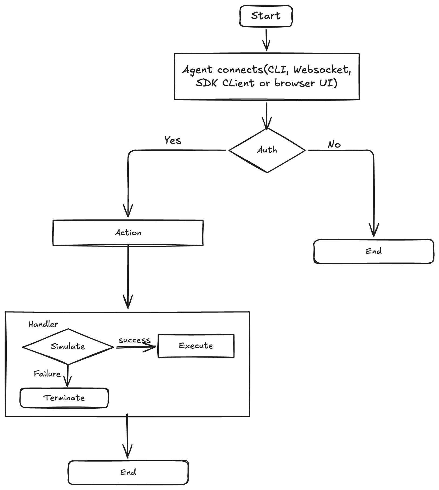

# Execra

Existing Solana wallets are built for humans — they require clicks, popups, and approval flows. Autonomous AI agents can't do any of that.

**Execra** is a Solana wallet daemon built specifically for agents. An AI can spin up a named wallet account, sign transactions, and interact with any Solana dApp — all without human intervention, browser popups, or storing a private key in plaintext.

---

## Demo

- [Watch the demo](https://drive.google.com/file/d/1yW9gADqz5iEkl94zw05CwIIFfHkUIE_y/view?usp=drive_link)
- [Tweet](https://x.com/0xMumin_/status/2031141640358768826?s=20)

---

## The problem

Every existing wallet assumes a human is present:
- Browser wallets pop up a confirmation dialog
- CLI wallets require a password prompt
- Custodial wallets store your keys on someone else's server

AI agents running autonomously have none of these options. They need a wallet that thinks the same way they do — name-based, programmatic, and always available.

---

## How it works

An agent connects with a name. That's it.

```typescript
import { AgentWallet } from "@execra/sdk";

const wallet = await AgentWallet.connect("Trading Bot");

const balance = await wallet.getBalance();
const { signature } = await wallet.signAndSendTransaction(tx);
```

If `"Trading Bot"` doesn't exist yet, a new BIP-44 derived account is created and persisted automatically. No password prompt. No browser popup. No private key in a config file.

If the daemon is running, the agent connects to it over WebSocket and the daemon handles signing. If not, it reads directly from the encrypted vault using the `WALLET_PASSWORD` env var. Either way, the agent's code doesn't change.

---

## Wallet Flow



---

## Architecture

```
┌────────────────────────────────────────────────────────────┐
│                    Execra Daemon                           │
│                                                            │
│   CLI Dashboard (Ink/React) ── live account + agent view   │
│                                                            │
│   ┌──────────────┐  ┌─────────────┐  ┌───────────────┐     │
│   │  /ws/agent   │  │  /ws/dapp   │  │  MCP Server   │     │
│   │  Agent SDK   │  │  Chrome Ext │  │  Claude AI    │     │
│   └──────┬───────┘  └──────┬──────┘  └──────┬────────┘     │
│          └─────────────────┴────────────────┘              │
│                      Request Handler                       │
│               simulate → sign → broadcast                  │
│                                                            │
│                  AES-256-GCM Vault                         │
│              (mnemonic only, never private keys)           │
└────────────────────────────────────────────────────────────┘
         │                              │
   Solana RPC                    WalletConnect v2
  (Helius / public)            (any browser dApp)
```

Every request — from any surface — flows through the same pipeline: simulate the transaction first, reject if it would fail, then sign. No request bypasses simulation.

---

## Monorepo structure

```
execra/
├── packages/
│   ├── core/          # vault, HD derivation, Solana RPC, transaction pipeline
│   ├── sdk/           # @execra/sdk — AgentWallet class for Node.js agents
│   ├── mcp/           # @execra/mcp — MCP server for Claude Desktop / Code
│   └── cli/           # @execra/daemon — daemon + CLI dashboard (execra binary)
└── apps/
    ├── web/           # Landing page
    └── extension/     # Chrome extension (Manifest V3, window.solana)
```

---

## Integration surfaces

| | AgentWallet SDK | WebSocket | MCP Server | Chrome Extension |
|---|---|---|---|---|
| **Package** | `@execra/sdk` | — | `@execra/mcp` | `apps/extension` |
| **Language** | TypeScript | Any | Claude AI | Browser |
| **Daemon needed** | No | Yes | No | Yes |
| **Best for** | Node.js agents | Python / Rust bots | Claude Desktop / Code | Agents controlling a browser |
| **Auth** | Vault password or daemon | Daemon | `WALLET_PASSWORD` env var | Daemon |

---

## Features

- **Named accounts** — agents connect by name, keypairs auto-derived from the vault seed
- **HD wallet** — BIP-39 mnemonic + BIP-44 derivation, same standard as Phantom, Backpack, Solflare
- **Transaction simulation** — every sign-and-send is simulated first; bad transactions are rejected before signing
- **MCP server** — Claude can list accounts, check balances, transfer SOL, send tokens, sign messages, and simulate transactions via natural language
- **Chrome extension** — Manifest V3 extension registers `window.solana` so any dApp works without installing a separate wallet
- **WalletConnect v2** — pair with browser dApps directly from the CLI dashboard
- **AES-256-GCM vault** — private keys never touch disk, mnemonic encrypted with PBKDF2-SHA512 (210,000 iterations)

---

## Quick start

```bash
pnpm install
pnpm build

# Start the daemon + CLI dashboard
pnpm dev
```

Set `WALLET_PASSWORD` in `.env` to skip the unlock prompt on startup.

See [SKILLS.md](SKILLS.md) for the full reference — CLI commands, MCP tools, WebSocket protocol, AgentWallet SDK API, and Chrome extension setup.

---

## Roadmap

### 1. Globally installable CLI

```bash
npm install -g @execra/daemon
execra init
```

Publish `@execra/daemon` as an npm package. All dashboard commands exposed as subcommands. Pre-built zero-dependency binaries via `bun build --compile`.

---

### 2. Standalone MCP package

```bash
npm install -g @execra/mcp
```

Publish `@execra/mcp` to npm so anyone can add it to Claude Desktop or Claude Code without cloning the repo.

---

### 3. Full wallet UI

Expand the Chrome extension popup and CLI dashboard into a complete wallet interface:

- SPL token portfolio with names, logos, and USD values
- Human-readable transaction history (swap, transfer, NFT mint, etc.)
- NFT display and transfers
- Open DeFi positions (liquidity, staking, lending) and claimable rewards
- Connected dApps manager with session revocation
- Custom RPC, preferred explorer, auto-lock timeout
